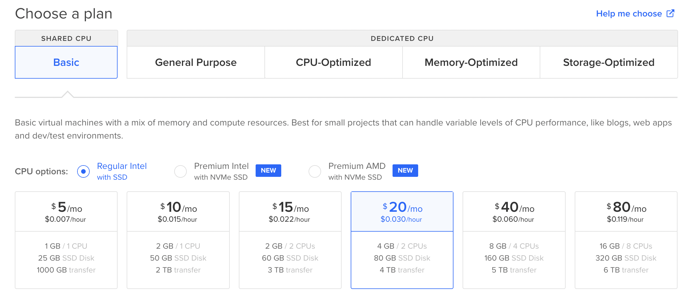
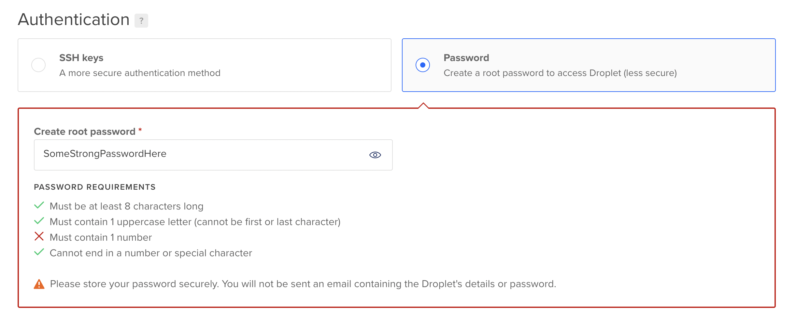
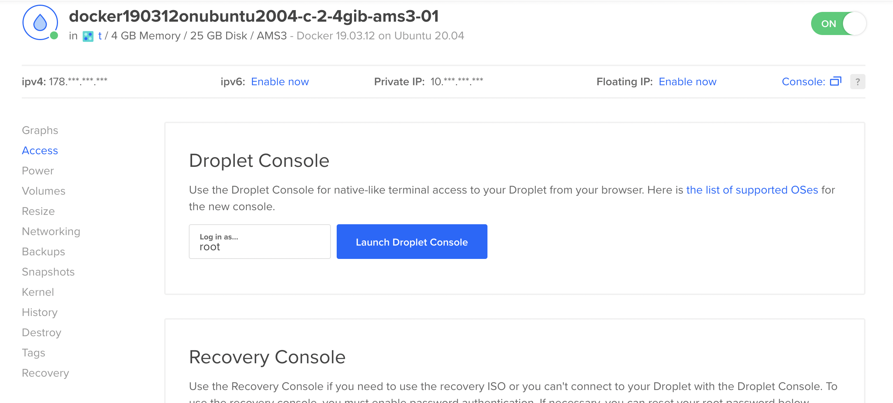
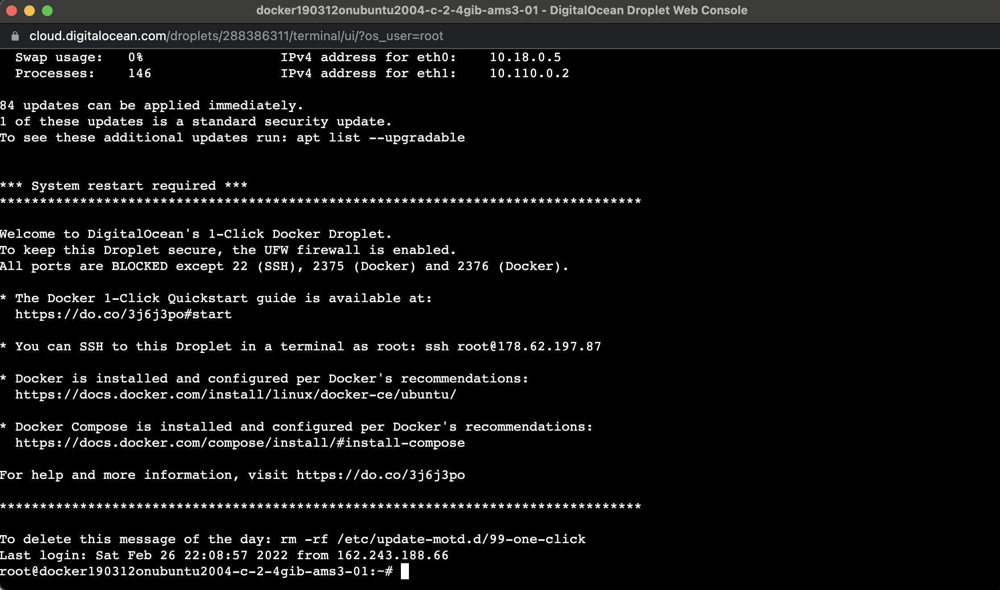
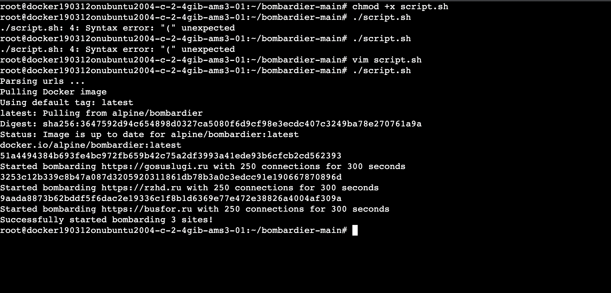

# Bombardier script using Docker

This script parses domains, receive their IP in DNS and then run multiple Docker containers that execute site bombarding (DDoS). Fill domains.txt with domains you want to bombard. The default setting is 250 open connections for 30 mins.

## Docker Installation

https://docs.docker.com/engine/install/ubuntu/

## Usage

```shell
chmod +x script.sh
./script.sh
```

### INSERT DOMAINS WITHOUT PROTOCOL (e.g. google.com instead of https://google.com)

## For beginners

1. Register or login on
   https://digitalocean.com

2. Open https://cloud.digitalocean.com/droplets/new

3. Choose the same settings as on the images below
   
   
   
   

4. Click 'Create droplet' in the bottom

5. After droplet was created, open details and click 'Access' on the left sidebar

6. Click 'Launch Droplet Console'
   

7. (optional) Paste sites you're going to bombard to the file domains.txt (each domain on the separate line)

8. Paste these commands to the opened terminal window
   

```shell
apt install -y unzip

wget https://codeload.github.com/capcatd/bombardier/zip/refs/heads/main >> main.zip && unzip main && cd bombardier-main

chmod +x script.sh

./script.sh
```

9. After everythins is done you should see similar message
   
